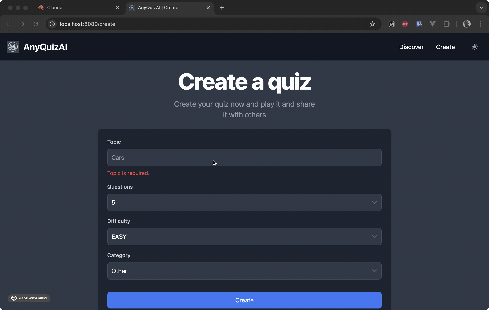
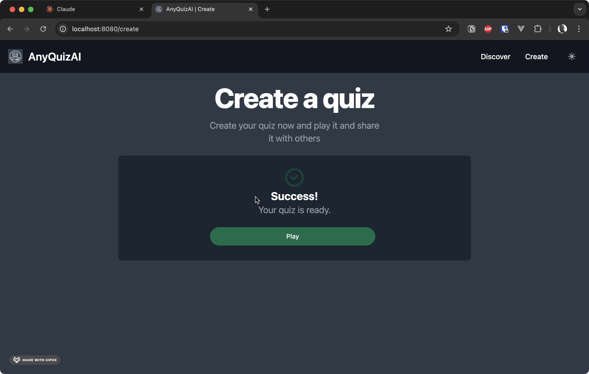
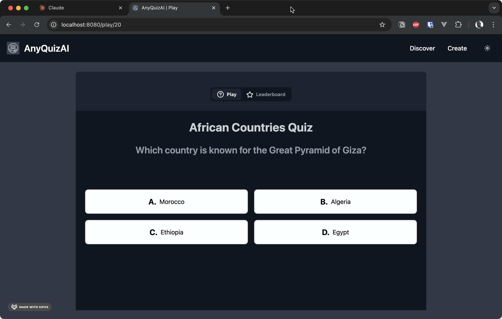
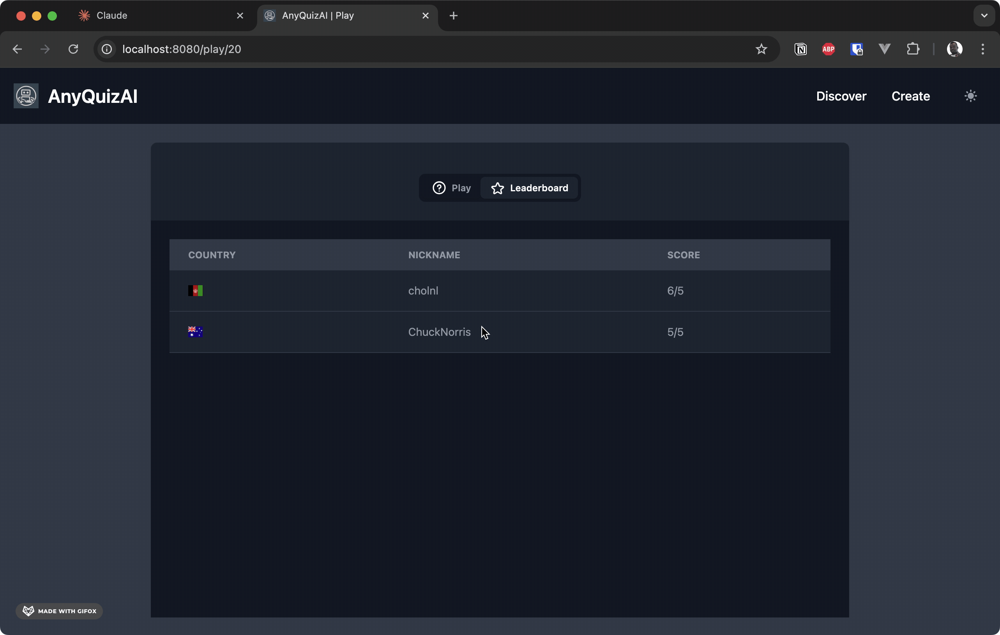
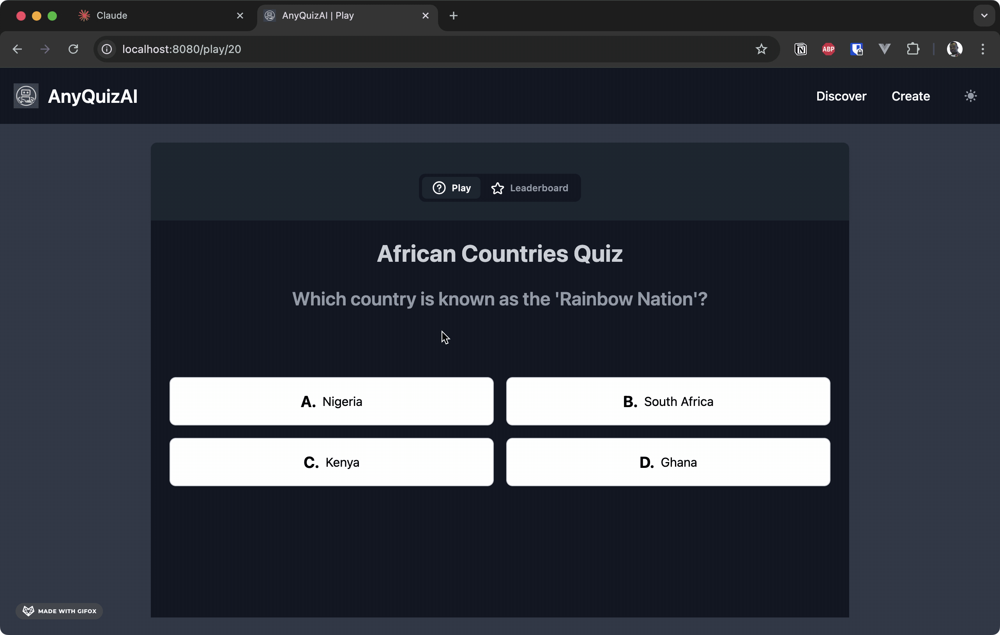

# AnyQuizAI

AnyQuizAI is a full-stack project I developed to practice and showcase my full stack developer skills. This project incorporates novel technologies such as Spring AI and demonstrates the development of LLM-driven applications.

## Project Purpose

**Important:** I created AnyQuizAI as a personal project to hone my full stack development skills and gain hands-on experience with cutting-edge technologies. It serves as a practical example of building a complete web application that integrates various components of modern web such as Angular and Tailwind CSS.

## Features

### 🔍 Discover

Discover allows users to find quizzes to play with advanced search options. The search functionality is powered by Elasticsearch, providing improved filtering and speed.


### ✨ Create

Create leverages the power of OpenAI through Spring AI to generate quizzes and save them to the database. Users can specify the topic, difficulty, number of questions, and more.





### 🎮 Play

Once you've discovered a quiz, you can play it and compete for a spot on the leaderboard.







## Getting Started

To run the application for development please use Java 21 (I recommend using SDKMAN), follow these steps:

1. Ensure you have Docker installed on your system.

2. Set your OpenAI API key as an environment variable:
   ```
   export OPENAI_API_KEY="yourOpenAIKey"
   ```
3. Create quiz photos directory
```
mkdir /var/quiz_photos
chmod -R 777 /var/quiz_photos
```

4. Start the required services using Docker Compose:
   ```
   docker-compose up -d
   ```

5. Run the Spring Boot application:
   ```
   ./mvnw spring-boot:run
   ```

## License

This project is licensed under the MIT License - see the [LICENSE](LICENSE) file for details.
